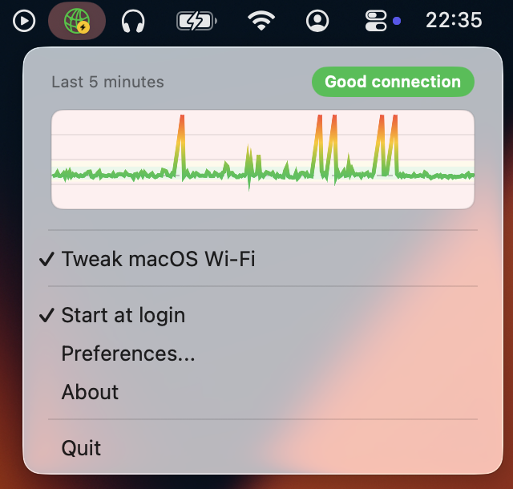

# linkq
    

Dead simple macOS menu bar utility for monitoring connection quality.

- ICMP/TCP probes
- Good/Average/Poor/Offline status
- 5-minute menu graph and longer history in settings
- Optional macOS Wi-Fi tweak for lower latency spikes

You can download the latest signed universal binary on the [Releases](https://github.com/Renset/linkq/releases) page.

## Screenshot

## Probe limitations
ICMP mode requires ICMP packets to be allowed by your network. Use TCP mode if ICMP is blocked.

## Motivation
I wanted a tiny menu bar indicator for network glitches during calls and games.

## Contribution
Contributions are welcome.

## Build
Open `linkq.xcodeproj` and build the `linkq` scheme.

## License
MIT. See [LICENSE](https://github.com/Renset/linkq/blob/main/LICENSE) for details.
